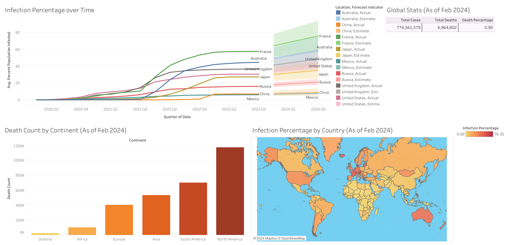

# COVID-19 Data Exploration & Visualization

This project was created as a learning excercise to build skills in data analytics and SQL querying. 

The CSV file was provided by [Our World in Data](ourworldindata.org/covid-deaths) 

An interactive dashboard can be found here: [Dashboard](https://public.tableau.com/app/profile/corey.merritt5468/viz/COVIDData_17090071351950/Dashboard)

